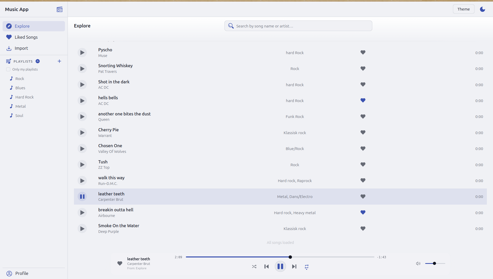

# Music UI

### Getting Started

* `npm run build`
* `npm run dev`

## Design

## final version, Dark mode (forest theme)

## Light mode (forest theme)

## dark mode (ember theme)

## Light mode (storm theme)

